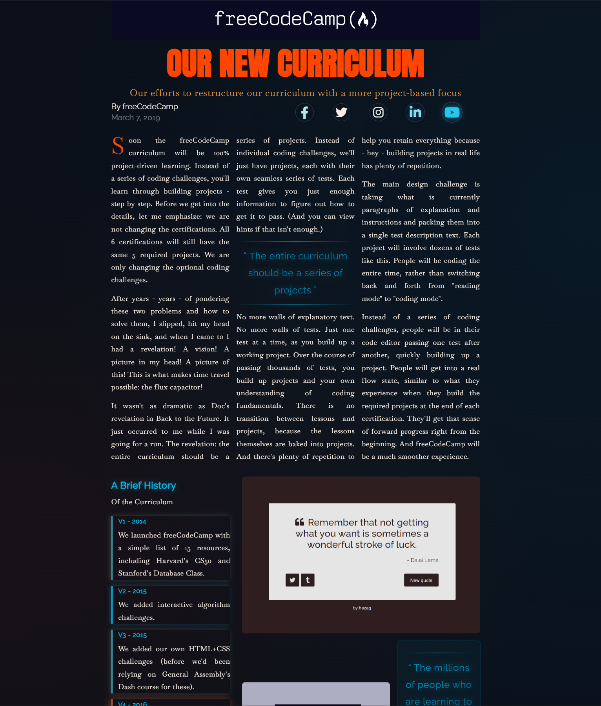

# Magazine Layout

A fully animated editorial magazine page built with pure HTML and CSS. CSS Grid, multi-column text, drop cap, shimmer gradient quotes, and nine separate keyframe animations - no JavaScript.

---

## What it does

Reproduces the layout and feel of a real editorial article: a hero banner, byline, social links, multi-column body copy with a pull quote, and a two-column section combining a version history timeline with a floating image gallery. Every section animates in on load, and individual elements have their own independent looping animations.

---

## Demo



> **To run locally:** open `index.html` directly in any browser. No server needed.

---

## Stack

| Layer | Tech |
|---|---|
| Structure | HTML5 - semantic `main`, `section`, `article`, `aside`, `blockquote`, `header`, `footer` |
| Styling | CSS3 - CSS Grid, `column-width`, `::first-letter`, `background-clip: text`, `backdrop-filter`, keyframe animations |
| Fonts | Anton (headings), Baskervville (body), Raleway (subheadings) via Google Fonts |
| Icons | Font Awesome 6 (social media icons) |

No npm. No JavaScript. No build step.

---

## Getting started

```bash
# Clone the repo
git clone https://github.com/dmtr-g/magazine-layout.git
cd magazine-layout

# Open in browser (pick your OS)
open index.html        # macOS
start index.html       # Windows
xdg-open index.html    # Linux
```

Or just double-click `index.html` in your file explorer.

---

## Features

- **CSS Grid page layout** - three-column outer grid (`minmax(2rem, 1fr) minmax(min-content, 94rem) minmax(2rem, 1fr)`) keeps content centred at any viewport width
- **Nested grids** - heading section, image wrapper, and social icons each use their own independent grid
- **Multi-column body text** - `column-width: 25rem` creates a newspaper-style column flow that adapts automatically to the available space
- **Drop cap** - `::first-letter` pseudo-element on the opening paragraph, styled in orangered with a `drop-shadow` filter and a looping pulse animation
- **Shimmer gradient quotes** - `background-clip: text` + `background-size: 200%` + a `shimmer` keyframe creates a moving colour sweep across blockquote text
- **Nine keyframe animations** - `fadeInUp`, `slideInLeft`, `slideInRight`, `heroImgReveal`, `pulse`, `pulseGlow`, `iconPulse`, `borderPulse`, `floatImage`, and `shimmer` all run independently
- **Staggered animation delays** - social icons and timeline list items use `:nth-child` selectors to stagger their `iconPulse` and `borderPulse` animations
- **Floating images** - gallery images use a looping `translateY` animation with offset delays so they float out of sync with each other
- **Animated underline on author link** - `::after` pseudo-element with a gradient `background` grows from 0 to 100% width on hover, no JavaScript
- **`prefers-reduced-motion`** - a media query disables all animations and transitions for users who have requested reduced motion, meeting WCAG 2.1 AAA
- **Lazy image loading** - `loading="lazy"` on all `` tags
- **Four responsive breakpoints** - layout adapts at 720px, 600px, 550px, and 420px

---

## Project structure

```
Building-a-Magazine/
├── index.html    # All markup - hero, article text, timeline, image gallery, footer
├── styles.css    # All styling - grid layout, animations, typography, responsive
└── README.md
```

---

## What I learned / Why I built this

This was the freeCodeCamp CSS Grid magazine project. I pushed the styling well beyond the brief to practise advanced CSS techniques in a real editorial context.

Key things practised:

- Outer CSS Grid with `minmax()` columns as a centring technique - cleaner than `max-width` + `margin: auto` for full-bleed sections
- `column-width` for automatic multi-column text flow without hardcoding a column count
- `::first-letter` pseudo-element for drop cap styling - applies only to the first letter of the first paragraph without any extra markup
- `background-clip: text` with an animated `background-position` to create the shimmer effect on blockquote text
- Staggered `:nth-child` animation delays to give sequential entrance timing without JavaScript
- `prefers-reduced-motion` to make the page accessible to users with vestibular disorders - disables all animations in one block
- `filter: drop-shadow()` vs `box-shadow` - `drop-shadow` follows the shape of the element including transparent areas
- `backdrop-filter: blur()` on the inline image blockquote for a frosted glass effect
- `loading="lazy"` as a simple, no-cost performance improvement on image-heavy pages

---

## Author

**Dumitru Gafincu** - [github.com/dmtr-g](https://github.com/dmtr-g) - 115009621+dmtr-g@users.noreply.github.com

---

*Built as part of the freeCodeCamp Responsive Web Design curriculum.*
